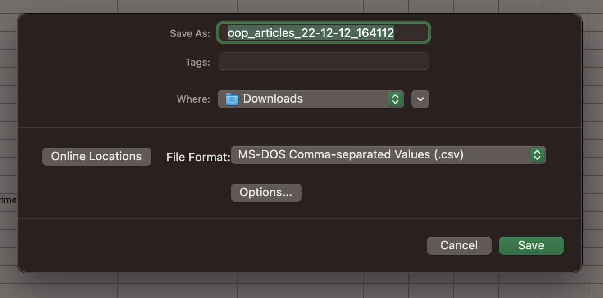
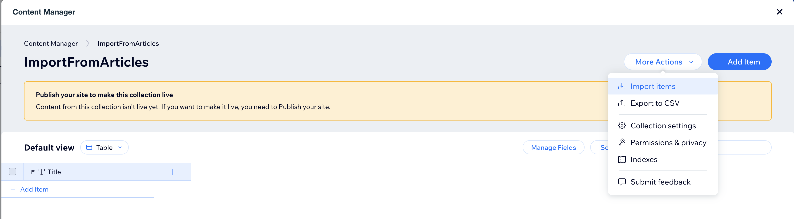
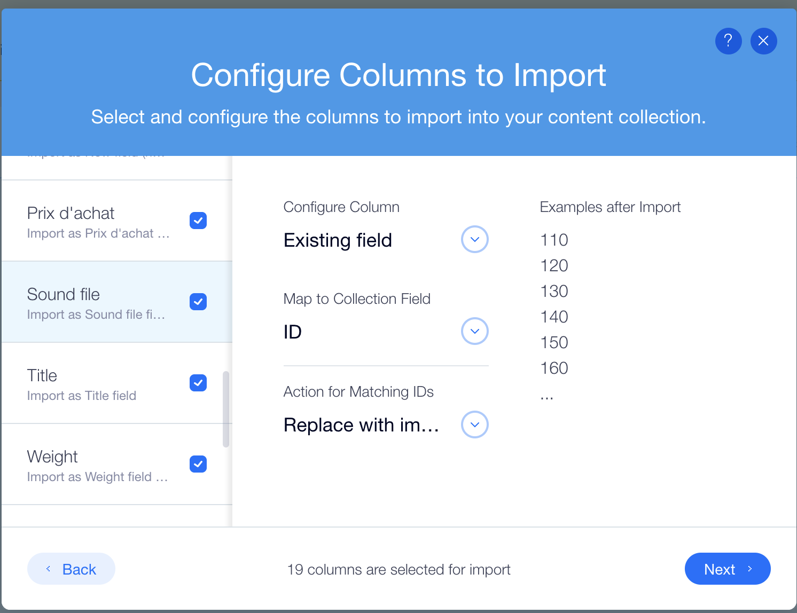
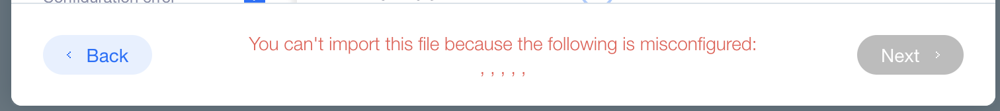
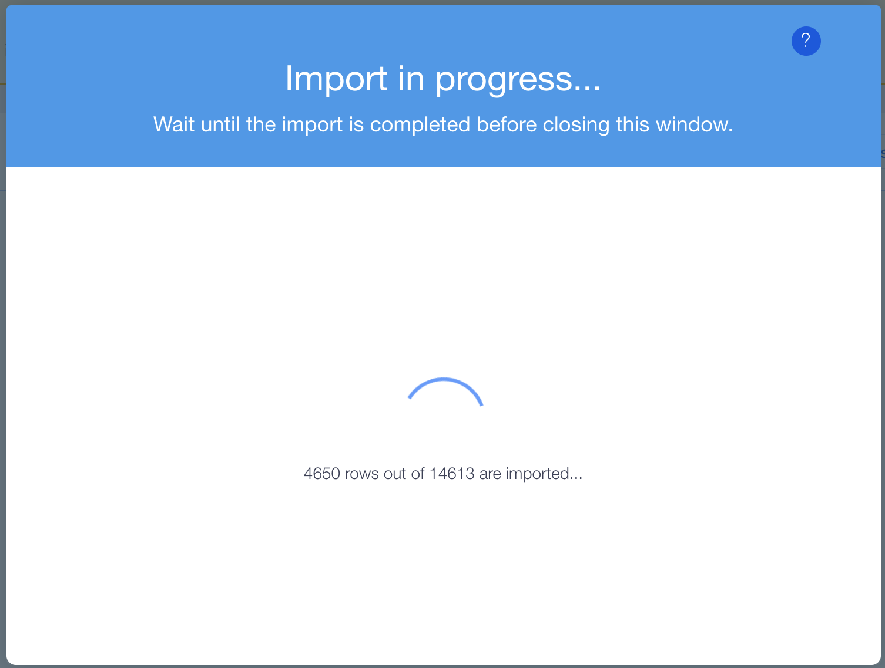
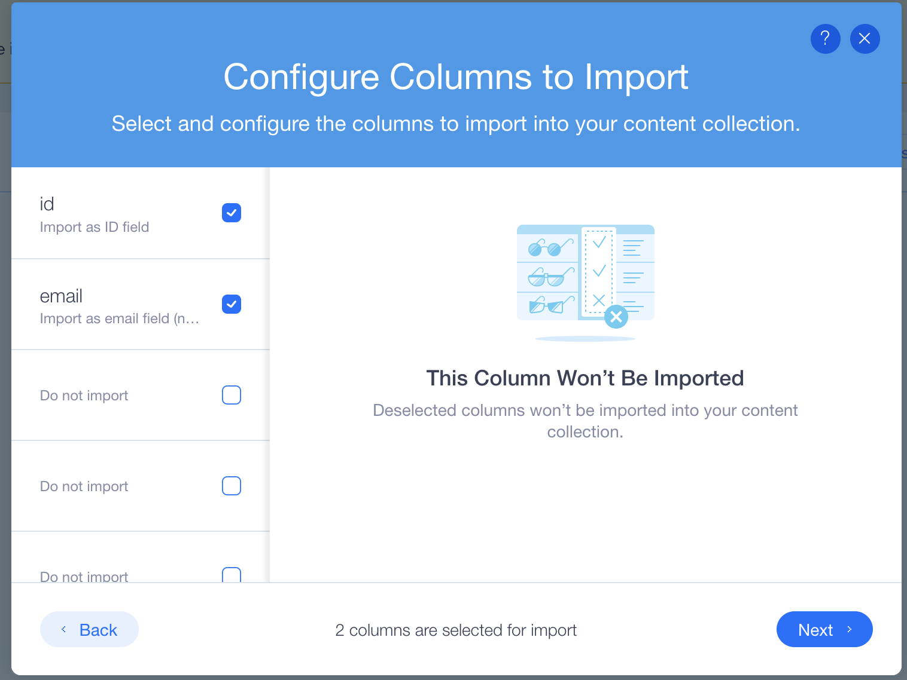

# Import the articles

The document describes Out of Print data migration steps. To be able to start megiration process source excel files have to be prepared first.

## Import preparation
1. Open target Excel file (<b>oop_articles_22-12-12_164112.xlsx</b> as an example) in Excel programm.
2. Delete first empty row from Excel document 

     <b style="color:gray">Notice:</b> if the row will not be deleted csv file import operation may have the issues.
    
3. Make sure that all columns in Excel document have names. Ideally all the names should be in English. The column should be either removed or name should be assigned. 

    <b style="color:darkorange">Important:</b> 3 latest columns in oop_articles_22-12-12_164112.xlsx have no name.  (I gave "<b>Comments</b>", "<b>Notes</b>", "<b>Notes2</b>")
4. Save Excel document as csv file.

    

## Editors Import
The section describes import stepts for Editor X data sources.
1. Go to Editor X project and open Content Manager.
2. Once the manager is open chose <b>ImportFromArticles</b> data source (Content Manager -> ImportFromArticles).
3. Delete all the items in the data table if the table is not empty.
4. Choose Import Items menu option.

    
5. Select <b>oop_articles_22-12-12_164112.csv</b> file from the location you used when was doing "<i>Save Excel document as csv file</i>" operation.
6. Once the file was uploaded make sure that there are no warning messages and Editor X recongnized all columns.

    
     
     
    <b style="color:gray">Notice:</b> On the screenshot below there is a warning message that says that imported file was not prepared properly:

    
    

7. Tap on "Next" button.
8. Review the mappings and tap on "Import" button.
9. Wait while import operation complete

    

9. When import complete you will see the table with imported data. Close the manager.

## Import Users
Import users data is the same operation as the previous but with some small particularities:
1. Users file (oop_users_20221212.xlsx)
2. Exitr X Content Manager -> ImportFromUsers
3. For the users we have only 2 columns to import (Id and Email) for all other detected columns just unselect the mapping

    
4. Once the file was uploaded Tap "Manage Fields" and set Email as a primary field and remove Title field
    
## Import Orders
Import orders data is the same operation as the previous but with some small particularities:
1. Orders file (oop_orders_22-12-12_160029.xlsx)
2. Exitr X Content Manager -> ImportFromOrders
3. For the orders we have only 4 columns to import. All other detected columns should be just unselected during the mapping.
4. Once the file was uploaded Tap "Manage Fields" and set OrderReference as a primary field and remove Title field
